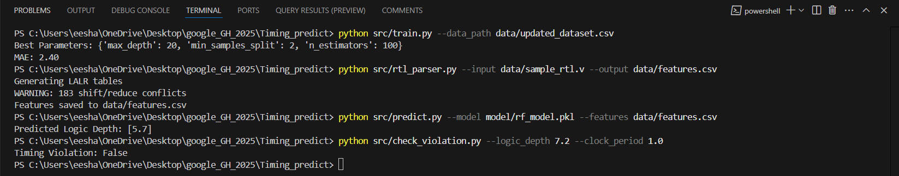
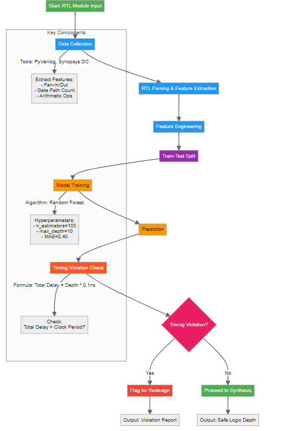

# ⚡ TimingPredict  
**AI-Powered Combinational Logic Depth Prediction for RTL Designs**  
*Accelerate Timing Validation by 10x Without Synthesis*  

[](https://opensource.org/licenses/MIT)  
[](https://www.python.org/)  

---

## 🚀 Why TimingPredict?  
**Problem**: Timing violations are detected post-synthesis, causing weeks of delays.  
**Solution**: Predict combinational logic depth **during RTL design** with **MAE ≤2.5** using ML.  
**Impact**: Slash design iteration time by 70% for hardware teams.  

---

## ⚙️ Installation  
```bash  
git clone https://github.com/eesha2501/Timing_Predict  
cd TimingPredict  
pip install -r requirements.txt  
```
---
## 🎯 Quick Demo
1. Predict Logic Depth for an RTL File:
```bash 
# Extract features from RTL  
python src/rtl_parser.py --input data/sample_rtl.v --output data/features.csv  
# Predict logic depth  
python src/predict.py --model model/rf_model.pkl --features data/features.csv  
```
Output: Predicted Logic Depths: [5.7]

2. Check Timing Violation
```bash  
python src/check_violation.py --logic_depth 7.2 --clock_period 1.0 
```

3. Train Your Own Model:
```bash  
python src/train.py --data_path data/updated_dataset.csv  
```
---
## 📸 Demo Output  
```bash 
python src/predict.py
```
Prediction Output:  

---
## 🛠️ Workflow  



## 🔥 Features
| Metric               | TimingPredict        | Traditional Tools  |  
|----------------------|----------------------|--------------------|  
| **Speed**            | 0.2 ms/prediction    | 2+ hours           |  
| **Accuracy (MAE)**   | 2.40                 | N/A (Ground Truth) |  
| **Scalability**      | 10k+ Gates           | Limited by EDA     |  

---
#🛠️ Tech Stack
1. ML Model: Random Forest Regressor (Scikit-learn)
2. RTL Parsing: PyVerilog + Custom Feature Extractor
3. Validation: Timing Violation Checker (check_violation.py)
---
## 📈 Future Roadmap
1. Integrate real-time RTL-to-gate path analysis.
2. Improve MAE to <1.5 with larger datasets.
3. Add GUI for non-technical users.


---
## 📜 License
MIT © 2025 Eesha Singh


